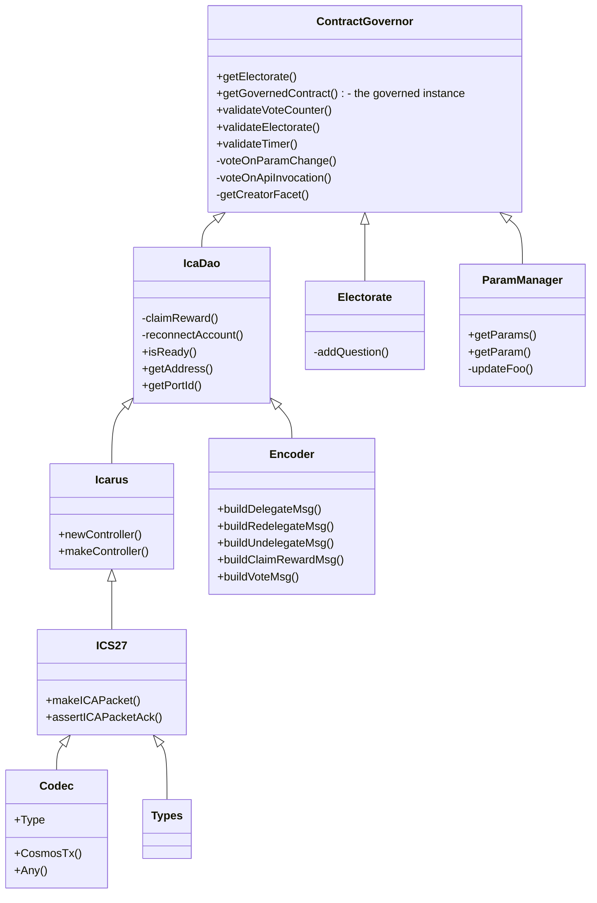

```mermaid
classDiagram

    Icarus <|-- ICS27
    ICS27 <|-- Codec
    ICS27 <|-- Types
    IcaDao <|-- Icarus
    IcaDao <|-- Encoder
    ContractGovernor <|-- IcaDao
    ContractGovernor <|-- Electorate
    ContractGovernor <|-- ParamManager


    class Icarus{
        +newController()
        +makeController()
    }
    class ICS27{
        +makeICAPacket()
        +assertICAPacketAck()
    }
    class Types{

    }
    class Codec{
    +CosmosTx()
    +Any()
    +Type
    }

    class IcaDao{
        -claimReward()
        -reconnectAccount()
        +isReady()
        +getAddress()
        +getPortId()
    }
    class Encoder{
        +buildDelegateMsg()
        +buildRedelegateMsg()
        +buildUndelegateMsg()
        +buildClaimRewardMsg()
        +buildVoteMsg()
    }
    class ContractGovernor{
        +getElectorate()
        +getGovernedContract() - the governed instance
        +validateVoteCounter()
        +validateElectorate()
        +validateTimer()
        -voteOnParamChange()
        -voteOnApiInvocation()
        -getCreatorFacet()
    }
    class Electorate{
        -addQuestion()
    }
    class ParamManager{
        +getParams()
        +getParam()
        -updateFoo()
    }
```
